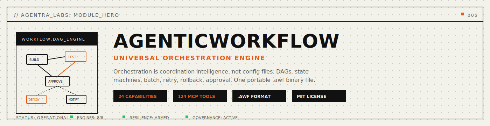
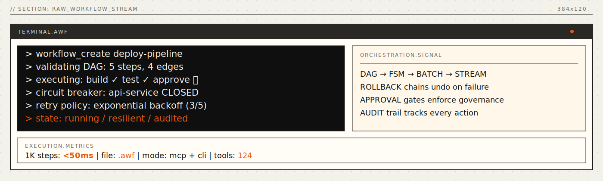
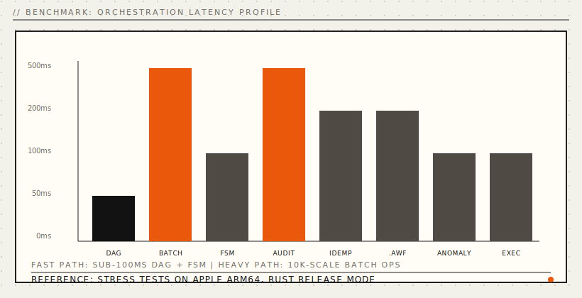
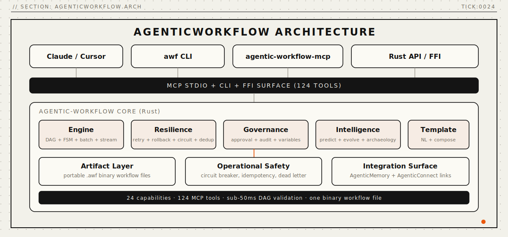

<p align="center">
  
</p>

<p align="center">
  <a href="https://crates.io/crates/agentic-workflow"></a>
  
  
</p>

<p align="center">
  <a href="#install"></a>
  <a href="#mcp-server"></a>
  <a href="LICENSE"></a>
  <a href="paper/paper-i-orchestration/agenticworkflow-paper.pdf"></a>
  <a href="docs/api-reference.md"></a>
</p>

<p align="center">
  <strong>Universal orchestration engine for AI agents.</strong>
</p>

<p align="center">
  <em>Every workflow coordinated. Every step tracked. Every failure recovered. Always.</em>
</p>

<p align="center">
  <a href="#problems-solved">Problems Solved</a> · <a href="#quickstart">Quickstart</a> · <a href="#the-24-capabilities">24 Capabilities</a> · <a href="#how-it-works">How It Works</a> · <a href="#mcp-tools">MCP Tools</a> · <a href="#benchmarks">Benchmarks</a> · <a href="#install">Install</a> · <a href="docs/api-reference.md">API</a> · <a href="paper/paper-i-orchestration/agenticworkflow-paper.pdf">Paper</a>
</p>

---

## Every orchestration tool solves one pattern.

Airflow runs DAGs but requires Kubernetes. Temporal does durable execution but needs a server. GitHub Actions does CI but can't branch dynamically. Zapier connects triggers but can't roll back. **Every tool requires infrastructure, and none is AI-native.**

The current fixes don't work. YAML pipelines are rigid -- you can't add a step at runtime. Cron schedulers don't know about holidays or service health. Retry logic is one-size-fits-all. Approval gates are yes/no checkboxes. And no orchestration tool lets your AI agent *create, modify, and reason about* the workflow itself.

**AgenticWorkflow** orchestrates *every* coordination pattern in a single engine. DAGs, state machines, batch processing, stream processing, fan-out/fan-in -- all through 124 MCP tools. Not "configure a YAML file." Your agent *thinks* about workflows -- plans them, validates them, executes them, retries intelligently, rolls back on failure, and learns from every execution.

<a name="problems-solved"></a>

## Problems Solved (Read This First)

- **Problem:** every orchestration tool requires infrastructure (Kubernetes, servers, cloud services).
  **Solved:** single `.awf` binary file. Zero infrastructure. Works offline.
- **Problem:** workflow tools handle one pattern (DAGs OR state machines OR batch, never all).
  **Solved:** one engine for all patterns -- DAGs, FSMs, batch, stream, fan-out, triggers, schedules.
- **Problem:** retries are "3 times with backoff" regardless of failure type.
  **Solved:** failure-classified retry -- different strategies for rate limits, network errors, auth failures.
- **Problem:** when step 5 fails, steps 1-4 leave partial results with no undo.
  **Solved:** per-step rollback actions, executed in reverse order with cryptographic receipts.
- **Problem:** "deploy to production" auto-executes with no human check.
  **Solved:** approval gates with escalation chains, conditional auto-approval, and time-bounded decisions.
- **Problem:** "what happened at 3am that broke production?" requires log archaeology.
  **Solved:** structured, queryable audit trail. "Show all workflows that touched the billing DB."

```rust
use agentic_workflow::{Workflow, StepNode, StepType, Edge, EdgeType};
use agentic_workflow::engine::DagEngine;

let mut engine = DagEngine::new();

// Define a deployment pipeline
let mut wf = Workflow::new("deploy-pipeline", "Build, test, approve, deploy");
let build = StepNode::new("Build", StepType::Command {
    command: "cargo".into(), args: vec!["build".into(), "--release".into()],
});
let test = StepNode::new("Test", StepType::Command {
    command: "cargo".into(), args: vec!["test".into()],
});
let approve = StepNode::new("Approve", StepType::ApprovalGate {
    approvers: vec!["lead@team.com".into()], timeout_ms: Some(3600_000),
});
let deploy = StepNode::new("Deploy", StepType::McpTool {
    sister: "connect".into(), tool: "deploy".into(),
    params: serde_json::json!({"target": "production"}),
});

let (bid, tid, aid, did) = (build.id.clone(), test.id.clone(), approve.id.clone(), deploy.id.clone());
wf.add_step(build); wf.add_step(test); wf.add_step(approve); wf.add_step(deploy);
wf.add_edge(Edge { from: bid, to: tid.clone(), edge_type: EdgeType::Sequence });
wf.add_edge(Edge { from: tid, to: aid.clone(), edge_type: EdgeType::Sequence });
wf.add_edge(Edge { from: aid, to: did, edge_type: EdgeType::Sequence });

// Validate and execute
engine.register_workflow(wf).unwrap();
```

Four steps. One DAG. Approval gate before production. Retry intelligence. Rollback on failure. Works with Claude, Cursor, Windsurf, or any MCP client.

<p align="center">
  
</p>

---

<a name="the-24-capabilities"></a>

## The 24 Capabilities

Six categories. Twenty-four capabilities. Every orchestration pattern that exists or will exist.

### Core Engine (Capabilities 1-4)

| # | Capability | What it solves |
|:--|:----------|:---------------|
| 1 | **Universal DAG Engine** | Every coordination pattern in one graph -- linear, parallel, conditional, loops |
| 2 | **Execution Consciousness** | Full execution awareness -- live status, progress, ETA, intervention |
| 3 | **Intelligent Scheduling** | Context-aware cron -- skip holidays, respect service health, learn optimal times |
| 4 | **Trigger Omniscience** | Universal triggers -- file, webhook, schedule, API, workflow output, custom |

### Resilience (Capabilities 5-8)

| # | Capability | What it solves |
|:--|:----------|:---------------|
| 5 | **Retry Intelligence** | Per-failure-type retry -- exponential for rate limits, immediate for deadlocks |
| 6 | **Rollback Architecture** | Per-step undo with verification -- reverse order, cryptographic receipts |
| 7 | **Circuit Breaker Intelligence** | Workflow-aware breakers -- don't start step 1 if step 3's service is down |
| 8 | **Dead Letter Intelligence** | Classify failures, auto-retry on recovery, surface actionable summaries |

### Processing (Capabilities 9-11)

| # | Capability | What it solves |
|:--|:----------|:---------------|
| 9 | **Batch Processing** | Controlled parallelism, progress checkpoints, resume from interruption |
| 10 | **Stream Processing** | Continuous data -- file watch, webhooks, polling -- with backpressure and windowing |
| 11 | **Fan-Out / Fan-In** | "Query 5 APIs in parallel, wait for 3, merge results" as a first-class primitive |

### Governance (Capabilities 12-14)

| # | Capability | What it solves |
|:--|:----------|:---------------|
| 12 | **Approval Gates** | Escalation chains, conditional auto-approve, time-bounded, delegation |
| 13 | **Audit Trail** | Structured, queryable events -- who did what, when, to which resource |
| 14 | **Idempotency** | Built-in deduplication -- never send duplicate emails or double-charge |

### State (Capabilities 15-16)

| # | Capability | What it solves |
|:--|:----------|:---------------|
| 15 | **State Machine Engine** | First-class FSM -- Created → Paid → Shipped → Delivered with guard conditions |
| 16 | **Variable Scoping** | Hierarchical scope -- workflow → branch → step → iteration, with type checking |

### Intelligence (Capabilities 17-24)

| # | Capability | What it solves |
|:--|:----------|:---------------|
| 17 | **Workflow Templates** | Parameterized reusable patterns -- "deploy" template takes (app, host, env) |
| 18 | **Natural Language Workflow** | "Every morning, check inventory and reorder" → executable DAG |
| 19 | **Execution Archaeology** | Compare executions, detect anomalies, identify bottlenecks |
| 20 | **Predictive Execution** | "How long? Will it succeed? How much will it cost?" from history |
| 21 | **Workflow Evolution** | Health scoring, drift detection, optimization suggestions |
| 22 | **Dream State** | Idle-time maintenance -- pre-check deps, validate configs, surface insights |
| 23 | **Composition Algebra** | Workflow-of-workflows -- sequence, parallel, conditional operators on entire workflows |
| 24 | **Workflow Collective** | Share workflow patterns across teams with privacy verification |

---

<a name="benchmarks"></a>

## Benchmarks

Rust core. In-memory engines. Real numbers from stress tests:

<p align="center">
  
</p>

| Operation | Time | Scale |
|:---|---:|:---|
| DAG validate + topological sort | **<50ms** | 1,000 steps |
| Start executions | **<100ms** | 100 concurrent |
| Batch creation | **<500ms** | 10,000 items |
| Dead letter ingest + summary | **<500ms** | 10,000 items |
| Idempotency store | **<500ms** | 10,000 keys |
| Idempotency check | **<200ms** | 10,000 keys |
| Audit record + query | **<500ms** | 10,000 events |
| FSM transitions | **<100ms** | 1,000 steps |
| .awf write + read | **<200ms** | 100 workflows |
| Anomaly detection | **<100ms** | 1,000 executions |
| Variable cascade | **instant** | 1,000 depth |

> All stress tests measured on Apple ARM64, Rust 1.82, release profile. Every benchmark has a corresponding named test (`stress_dag_1000_steps_linear_chain`, `stress_batch_10k_items`, etc.).

<details>
<summary><strong>Comparison with existing systems</strong></summary>

<br>

| | Airflow | Temporal | GH Actions | Zapier | **AgenticWorkflow** |
|:---|:---:|:---:|:---:|:---:|:---:|
| All coordination patterns | DAG only | Saga | DAG | Trigger-action | **All** |
| Infrastructure required | Kubernetes | Server | Cloud | Cloud | **None** |
| AI-native (MCP) | No | No | No | No | **Yes** |
| Retry intelligence | Basic | Built-in | Basic | Basic | **Per-failure-class** |
| Rollback | No | Saga | No | No | **Per-step + verification** |
| Circuit breakers | No | No | No | No | **Workflow-aware** |
| Approval gates | No | No | Env gates | No | **Escalation chains** |
| Audit trail | Logs | Logs | Logs | Logs | **Structured + queryable** |
| State machines | No | No | No | No | **First-class** |
| Natural language WF | No | No | No | No | **Yes** |
| Predictive execution | No | No | No | No | **Yes** |

</details>

---

<a name="install"></a>

## Install

**One-liner** (desktop profile, backwards-compatible):
```bash
curl -fsSL https://agentralabs.tech/install/workflow | bash
```

Downloads pre-built `awf` and `agentic-workflow-mcp` binaries to `~/.local/bin/` and merges the MCP server into your Claude Desktop and Claude Code configs. If release artifacts are not available, the installer automatically falls back to `cargo install --git` source install.

**Environment profiles** (one command per environment):
```bash
# Desktop MCP clients (auto-merge Claude Desktop + Claude Code when detected)
curl -fsSL https://agentralabs.tech/install/workflow/desktop | bash

# Terminal-only (no desktop config writes)
curl -fsSL https://agentralabs.tech/install/workflow/terminal | bash

# Remote/server hosts (no desktop config writes)
curl -fsSL https://agentralabs.tech/install/workflow/server | bash
```

| Channel | Command | Result |
|:---|:---|:---|
| GitHub installer (official) | `curl -fsSL https://agentralabs.tech/install/workflow \| bash` | Installs release binaries; merges MCP config |
| GitHub installer (desktop) | `curl -fsSL https://agentralabs.tech/install/workflow/desktop \| bash` | Explicit desktop profile |
| GitHub installer (terminal) | `curl -fsSL https://agentralabs.tech/install/workflow/terminal \| bash` | Binaries only; no config writes |
| GitHub installer (server) | `curl -fsSL https://agentralabs.tech/install/workflow/server \| bash` | Server-safe behavior |
| crates.io (official) | `cargo install agentic-workflow-cli agentic-workflow-mcp` | Installs `awf` CLI and MCP server |

| Goal | Command |
|:---|:---|
| **Just give me workflows** | Run the one-liner above |
| **Rust developer** | `cargo install agentic-workflow-cli agentic-workflow-mcp` |

---

<a name="mcp-server"></a>

## MCP Server

**Any MCP-compatible client gets instant access to universal workflow orchestration.** The `agentic-workflow-mcp` crate exposes the full engine over the [Model Context Protocol](https://modelcontextprotocol.io) (JSON-RPC 2.0 over stdio).

```bash
cargo install agentic-workflow-mcp
```

### Configure Claude Desktop

Add to `~/Library/Application Support/Claude/claude_desktop_config.json`:

```json
{
  "mcpServers": {
    "agentic-workflow": {
      "command": "agentic-workflow-mcp",
      "args": ["serve"]
    }
  }
}
```

### Configure VS Code / Cursor

Add to `.vscode/settings.json`:

```json
{
  "mcp.servers": {
    "agentic-workflow": {
      "command": "agentic-workflow-mcp",
      "args": ["serve"]
    }
  }
}
```

<a name="mcp-tools"></a>

### What the LLM gets

| Category | Count | Examples |
|:---|---:|:---|
| **Tools** | 124 | `workflow_create`, `workflow_run`, `workflow_validate`, `workflow_fsm_transition`, `workflow_approve_decide`, `workflow_predict_duration` ... |
| **Resources** | -- | Planned |
| **Prompts** | -- | Planned |

Once connected, the LLM can create workflows, validate DAGs, execute pipelines, manage state machines, approve deployments, query audit trails, and predict execution outcomes -- all backed by the same `.awf` binary file.

---

<a name="quickstart"></a>

## Quickstart

### Create and run a workflow -- MCP tools

```
→ workflow_create { name: "daily-report", description: "Generate metrics" }
← { workflow_id: "wf-a1b2c3", steps: 0, status: "created" }

→ workflow_step_add { workflow_id: "wf-a1b2c3", name: "Query DB", type: "mcp_tool" }
← { step_id: "s-d4e5f6", position: 1 }

→ workflow_validate { workflow_id: "wf-a1b2c3" }
← { valid: true, steps: 3, edges: 2, warnings: [] }

→ workflow_run { workflow_id: "wf-a1b2c3" }
← { execution_id: "ex-g7h8i9", status: "running" }

→ workflow_progress { execution_id: "ex-g7h8i9" }
← { completed: 2, total: 3, percent: 66.7, eta_ms: 45000 }
```

### State machine -- order lifecycle

```
→ workflow_fsm_create { name: "order", initial: "Created", states: [...], transitions: [...] }
← { fsm_id: "fsm-j0k1l2" }

→ workflow_fsm_transition { fsm_id: "fsm-j0k1l2", event: "pay" }
← { from: "Created", to: "Paid", timestamp: "..." }

→ workflow_fsm_transition { fsm_id: "fsm-j0k1l2", event: "ship" }
← { from: "Paid", to: "Shipped" }
```

---

<a name="how-it-works"></a>

## How It Works

<p align="center">
  
</p>

AgenticWorkflow orchestrates every coordination pattern through six subsystems:

| Subsystem | Purpose | Key operations |
|:---|:---|:---|
| **Engine** | DAG execution, scheduling, triggers, batch, stream, fan-out, FSM | Create, validate, execute, pause, resume, cancel |
| **Resilience** | Failure survival | Retry, rollback, circuit breaker, dead letter, idempotency |
| **Governance** | Control and compliance | Approval gates, audit trail, variable scoping |
| **Template** | Reusable patterns | Templates, natural language, composition algebra |
| **Intelligence** | Learning from history | Archaeology, prediction, evolution, dream state |
| **Format** | Persistent state | `.awf` binary file with BLAKE3 checksums |

<details>
<summary><strong>.awf file format details</strong></summary>

```
+-------------------------------------+
|  HEADER           16 bytes          |  AWFL magic . version . counts
+-------------------------------------+
|  WORKFLOW REGISTRY                  |  All workflow definitions
|  (type u8 | length u32 | JSON | BLAKE3)
+-------------------------------------+
|  TEMPLATE LIBRARY                   |  Stored templates
+-------------------------------------+
|  EXECUTION HISTORY                  |  Past execution records
+-------------------------------------+
|  SCHEDULE TABLE                     |  Active schedules
+-------------------------------------+
|  STATE MACHINE TABLE                |  FSM definitions + current states
+-------------------------------------+
|  TRIGGER INDEX                      |  Active triggers
+-------------------------------------+
|  AUDIT LOG                          |  Structured audit events
+-------------------------------------+
|  IDEMPOTENCY CACHE                  |  Deduplication keys
+-------------------------------------+
|  VARIABLE STORE                     |  Scoped variables
+-------------------------------------+
```

Each section independently BLAKE3-checksummed. Corruption in one section doesn't affect others. LZ4 compression available.

</details>

---

## Validation

| Suite | Tests | |
|:---|---:|:---|
| Type system + serde | **59** | All variants, serialization roundtrips |
| Engine operations | **31** | DAG, FSM, batch, stream, fan-out, scheduler, trigger |
| Resilience | **27** | Retry, rollback, circuit breaker, dead letter, idempotency |
| Governance | **27** | Approval gates, audit trail, variable scoping |
| Template + Intelligence | **31** | Templates, NL, composition, archaeology, prediction, evolution |
| Edge cases | **28** | Boundary values, corruption detection, error paths |
| Stress tests | **14** | 1K-10K scale with time budgets |
| Persistence + execution | **39** | Store roundtrip, step execution, output propagation |
| Concurrent access | **11** | Multi-execution, multi-scope, multi-FSM |
| Inline unit tests | **14** | Core module self-tests |
| **Total** | **281** | All passing |

**One research paper:**
- [Paper I: AgenticWorkflow -- universal orchestration engine (10 pages, 8 figures, 11 tables, real stress test data)](paper/paper-i-orchestration/agenticworkflow-paper.pdf)

---

## Repository Structure

```
agentic-workflow/
├── Cargo.toml                      # Workspace root
├── crates/
│   ├── agentic-workflow/            # Core library (types, engines, resilience, governance, intelligence)
│   ├── agentic-workflow-mcp/        # MCP server (124 tools, stdio transport)
│   ├── agentic-workflow-cli/        # CLI binary (awf)
│   └── agentic-workflow-ffi/        # FFI bindings (C/Python/WASM)
├── assets/                          # Agentra design system SVGs
├── paper/                           # Research papers (I: Orchestration Engine)
├── scripts/                         # Install + guardrail scripts
├── docs/                            # Quickstart, API ref, concepts, benchmarks
└── .github/workflows/               # CI/CD pipelines
```

### Running Tests

```bash
# All workspace tests (unit + integration)
cargo test --workspace

# Stress tests only
cargo test -p agentic-workflow stress

# Single phase
cargo test -p agentic-workflow --test phase7_stress
```

---

## Deployment Model

- **Standalone by default:** AgenticWorkflow is independently installable and operable. Integration with AgenticMemory, AgenticCodebase, or other sisters is optional, never required.
- **Zero infrastructure:** No databases, no cloud services, no Kubernetes. Single `.awf` file holds everything.

| Area | Default behavior | Controls |
|:---|:---|:---|
| Data storage | `~/.local/share/agentic-workflow/` | `AWF_DATA_DIR` |
| Log level | `info` | `AWF_LOG=debug\|info\|warn\|error` |
| Transport | stdio (MCP default) | `--transport sse` for HTTP/SSE |

---

## Roadmap

| Feature | Status |
|:---|:---|
| Step execution runners (shell, HTTP, MCP) | Planned |
| Distributed execution via gRPC | Planned |
| Expression language for conditionals | Planned |
| Real-time trigger integration (inotify, kqueue) | Planned |
| Python SDK | Planned |
| Docker image | Planned |

---

## The .awf File

Your agent's orchestration state. One file. Zero infrastructure.

| | |
|-|-|
| Format | Binary, BLAKE3-checksummed, LZ4-compressed |
| Contains | Workflows, templates, executions, schedules, FSMs, triggers, audit log, variables |
| Works with | Claude, Cursor, Windsurf, Cody, any MCP client |
| Portability | Single file, copy anywhere |

---

## Philosophy

> "Orchestration tools shouldn't require more infrastructure than the workflows they orchestrate."

AgenticWorkflow stores everything in a single binary file. No Kubernetes. No managed services. No YAML. Your agent thinks in workflows -- let it.
